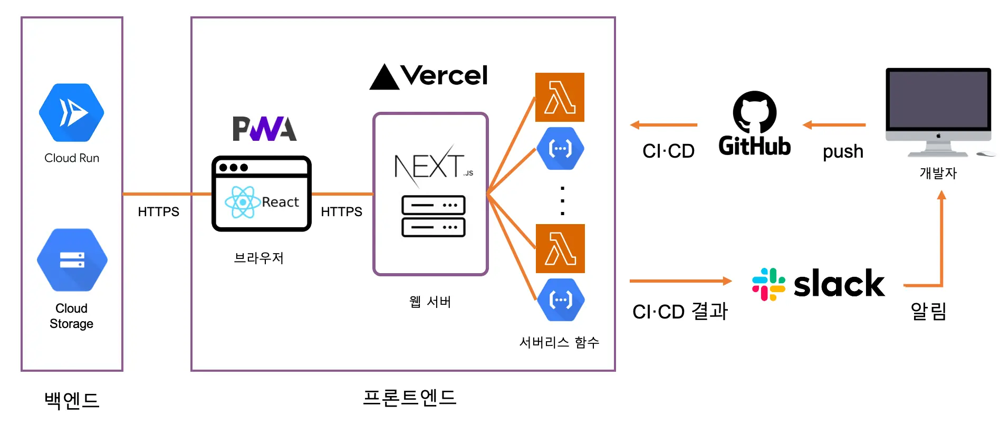

# ☁️ 소복 (Sobok)

소소한 행복 :)

2021년 8월 10일 (화) ~ ing

## Introduction

### Why

디저트 검색이 불편해서

### What

디저트 검색을 편리하게 만들자!

## Demo

### 사용법

https://sobok.vercel.app 에 들어오세요~

### 사진·영상

git 또는 이미지 첨부

## Requires

- macOS 11.2
- [Git](https://git-scm.com/downloads) 2.32
- [Node](https://nodejs.org/ko/download/) LTS
- [Yarn](https://yarnpkg.com/getting-started/install#about-global-installs) 3.0
- [Visual Studio Code](https://code.visualstudio.com/Download) 1.58
- Chrome 89.0, Safari 14.0, Whale 2.9, Firefox 87.0

```bash
$ git --version
$ node --version
$ yarn --version
$ code --version
```

위 명령어를 통해 프로젝트에 필요한 모든 프로그램이 설치되어 있는지 확인합니다.

## Project structure



## Quick start

### 프로젝트 다운로드

```shell
$ git clone 프로젝트-주소
$ cd 프로젝트-폴더
$ git checkout 브랜치-이름
$ yarn
```

프로젝트를 다운로드 받고 해당 폴더로 이동한 후 적절한 브랜치(`main` 등)로 이동하고 프로젝트에 필요한 외부 패키지를 설치합니다.

그리고 프로젝트 폴더에서 VSCode를 실행하면 오른쪽 아래에 '권장 확장 프로그램 설치' 알림이 뜨는데, 프로젝트에서 권장하는 확장 프로그램(ESLint, Prettier 등)을 모두 설치합니다.

### Create environment variables

```
NEXT_PUBLIC_BACKEND_URL=
NEXT_PUBLIC_GOOGLE_ANALITICS_ID=
NEXT_PUBLIC_KAKAO_JAVASCRIPT_KEY=
```

프로젝트 루트 경로에 `.env.development`과 `.env.production` 파일을 생성하고 거기에 프로젝트에 필요한 환경 변수를 설정합니다.

> [Next.js 환경 변수 (nextjs.org)](https://nextjs.org/docs/basic-features/environment-variables)

### Start Node.js server

```shell
$ yarn dev
```

파일 변경 사항이 바로 반영되는 Next.js 웹 서버를 실행합니다.

or

```shell
$ yarn build && yarn start
```

TypeScript 파일을 JavaScript로 트랜스파일 및 최적화한 후 Next.js 웹 서버를 실행합니다.

### 브라우저 실행

```
http://localhost:3000
```

브라우저에서 아래 주소로 접속하면 개발 중인 사이트를 볼 수 있습니다.

## Errors

### (Windows) PowerShell 보안 오류

```shell
$ Set-ExecutionPolicy Unrestricted
```

PowerShell을 관리자 권한으로 열어서 보안 정책을 위와 같이 수정해줍니다.

> https://velog.io/@gwak2837/powershell-yarn-보안-오류

## 스크립트

### Pre-Push

```shell
$ yarn pre-push
```

코드 포맷, 린트, TypeScript 타입 검사를 전부 수행합니다. 현재 이 명령어는 원격 저장소로 push 하기 전에 husky가 자동으로 실행해주고, 문제가 없는 경우에만 커밋을 원격 저장소로 push합니다.

### GraphQL Code Generator

```shell
$ yarn generate
```

서버로부터 GraphQL Schema를 받아서 이에 해당하는 TypeScript 자료형과 apollo hook 등을 자동으로 생성해줍니다. 서버나 로컬의 GraphQL Schema가 변경됐을 때마다 실행합니다.

### Build

```shell
$ yarn build
```

결과물에 웹 서버가 포함되도록 동적으로 빌드합니다. 이 경우 결과물에 웹 서버 로직, JSON, HTML, CSS, JS 등이 포함됩니다.
